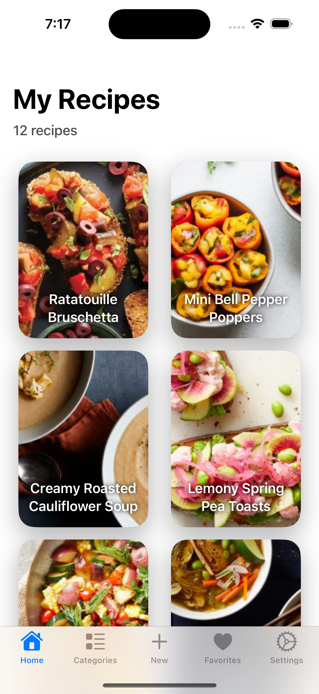

## RecipeSaver
Recipe Keeper is the easy to use, all-in-one recipe organizer available across all of your devices.

The live conference room was built using Twilio SDK (main features: one-on-one, one-to-many, community mode, live video player inside the room managed by the teacher, Airplay/HDMI and bluetooth headphones support). I was the sole mobile developer of the app.

##### 🔨Technologies: SwiftUI, MVVM + Clean Architecture, UI + Unit Tests, CI, Twilio SDK, StreamChat API, Push Notifications, AWS SDK, REST API (GraphQL on an early MVP).
##### 🚀Platform: 📱iOS, iPad.

